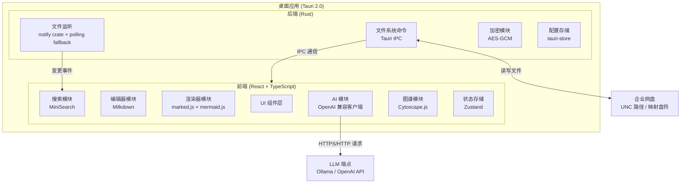

# 设计文档

## 概述

团队内部笔记分享平台是一个基于 **Tauri 2.0** 构建的跨平台桌面应用，前端使用 **React + TypeScript**，后端逻辑由 **Rust** 提供文件系统操作能力。应用以文件夹作为笔记库，所有笔记以标准 Markdown 文件形式存储在企业网盘（UNC 路径或映射盘符）上，多名团队成员通过访问同一网盘路径实现共享协作。

### 核心设计原则

- **无服务器**：不依赖任何后端服务，所有功能在客户端完成
- **开放格式**：笔记存储为标准 .md 文件，可用任意编辑器打开
- **性能优先**：搜索索引在本地构建，编辑器响应延迟不超过 500ms
- **安全第一**：所有渲染内容经过 DOMPurify 净化，API 密钥加密存储

---

## 架构

### 技术栈选型

| 层次 | 技术 | 说明 |
|------|------|------|
| 桌面框架 | Tauri 2.0 | Rust + WebView，体积小、安全性高，支持 Windows UNC 路径 |
| 前端框架 | React 18 + TypeScript | 组件化 UI，类型安全 |
| Markdown 编辑器 | Milkdown (基于 ProseMirror) | 统一引擎同时支持所见即所得和源码模式，内置 Markdown 序列化 |
| Markdown 渲染 | marked.js + DOMPurify | 高性能渲染加 XSS 净化 |
| 图表渲染 | mermaid.js | 支持流程图、时序图等多种 Mermaid 语法 |
| 全文搜索 | MiniSearch + jieba-wasm | 纯 JS 内存全文搜索，集成 jieba 中文分词 |
| 知识图谱 | Cytoscape.js | 开源图可视化库，渲染笔记关系图谱 |
| AI 接入 | 自实现 OpenAI 兼容客户端 | 支持标准 OpenAI API 格式和 Ollama 等本地 LLM |
| 状态管理 | Zustand | 轻量级状态管理 |
| 样式 | Tailwind CSS | 原子化 CSS，快速开发 |
| 构建工具 | Vite | 快速 HMR，生产构建优化 |
| 冲突控制 | 自实现 mtime 乐观锁 + diff-match-patch | 基于文件修改时间戳检测冲突，diff3 三路合并 |

### 整体架构图



---

## 组件与接口

### 1. 笔记库管理器（VaultManager）

负责打开、切换和持久化笔记库路径，并维护文件树状态。

```typescript
interface VaultManager {
  openVault(path: string): Promise<VaultResult>
  closeVault(): void
  getFileTree(): FileTreeNode[]
  getRecentVaults(): string[]
  watchVault(callback: (event: FileChangeEvent) => void): () => void
}

interface FileTreeNode {
  name: string
  path: string
  type: 'file' | 'folder'
  children?: FileTreeNode[]
}

interface VaultResult {
  success: boolean
  error?: string
  tree?: FileTreeNode[]
}
```

Rust 端通过 Tauri IPC 暴露文件系统命令。所有接受 path 参数的命令在执行前均通过 validate_path 函数校验路径合法性，拒绝越界访问。

```rust
/// 所有文件操作命令的内部路径校验函数
/// 确保目标路径经 canonicalize 后仍在 vault_root 之下
fn validate_path(vault_root: &Path, target: &str) -> Result<PathBuf, String> {
    let canonical = std::fs::canonicalize(target)
        .map_err(|e| format!("路径无效: {}", e))?;
    if !canonical.starts_with(vault_root) {
        return Err("拒绝访问：路径超出笔记库范围".into());
    }
    Ok(canonical)
}

#[tauri::command]
async fn open_vault(path: String) -> Result<Vec<FileNode>, String>

#[tauri::command]
async fn read_file_with_meta(path: String) -> Result<FileWithMeta, String>

#[tauri::command]
async fn write_file_safe(
    path: String, content: String, expected_mtime: u64
) -> Result<WriteResult, String>

#[tauri::command]
async fn watch_directory(
    path: String,
    window: Window,
    mode: WatchMode
) -> Result<(), String>
```

#### 文件监听双模式策略

由于 UNC 路径和部分网盘挂载对操作系统文件事件（ReadDirectoryChangesW）支持不可靠，文件监听采用双模式 fallback 策略：

1. **主模式（事件驱动）**：使用 notify crate 的 RecommendedWatcher，响应延迟低（<1s）
2. **Fallback 模式（轮询）**：使用 notify crate 的 PollWatcher，每 30 秒全量扫描文件 mtime 差异
3. **自动切换**：启动时先使用事件驱动模式，若 60 秒内未收到任何事件（包括心跳测试文件的变更事件），自动降级为轮询模式
4. **心跳检测**：启动监听后在笔记库根目录写入并删除一个 `.watch_test` 临时文件，用于验证事件驱动是否可用

### 2. 编辑器模块（EditorModule）

提供双模式编辑体验，基于 **Milkdown**（底层为 ProseMirror）统一引擎实现。

Milkdown 通过其插件体系原生支持 WYSIWYG 模式，并通过 `@milkdown/plugin-slash` 等插件提供源码/分栏预览模式。使用单引擎消除了 CodeMirror ↔ ProseMirror 之间模式切换时的内容格式丢失风险。

```typescript
interface EditorModule {
  mode: 'split' | 'wysiwyg'
  setMode(mode: 'split' | 'wysiwyg'): void
  getContent(): string
  setContent(content: string): void
  onContentChange(callback: (content: string) => void): void
  insertImage(imagePath: string): void
  formatDocument(): void
  isDirty(): boolean
}
```

编辑器防抖更新机制：内容变更后 300ms 内若无新输入则触发渲染和索引更新。

Milkdown 插件配置：
- `@milkdown/preset-commonmark`：基础 Markdown 语法
- `@milkdown/preset-gfm`：表格、任务列表、删除线
- `@milkdown/plugin-slash`：斜杠命令
- `@milkdown/plugin-tooltip`：浮动工具栏
- `@milkdown/plugin-prism`：代码块语法高亮
- 自定义 WikiLink 插件：`[[]]` 语法支持与自动补全
- 自定义 Mermaid 插件：识别 mermaid 代码块并调用 RendererModule 渲染

### 3. 渲染器模块（RendererModule）

将 Markdown 转换为安全 HTML，并处理 Mermaid 代码块渲染。

```typescript
interface RendererModule {
  render(markdown: string): string
  renderMermaid(definition: string): Promise<SVGElement>
}
```

渲染管道按以下顺序执行：

1. marked.js 将 Markdown 解析为 HTML
2. 提取并替换 mermaid 代码块为 SVG 图形
3. DOMPurify 对最终 HTML 进行净化

DOMPurify 白名单配置仅允许安全的展示性标签，禁止 script、style、iframe、form 等可执行标签，并拒绝所有事件处理属性（onerror、onload 等）。

### 4. 搜索引擎（SearchEngine）

使用 MiniSearch 在内存中构建倒排索引，通过 Web Worker 在后台完成索引构建和搜索执行，避免阻塞 UI。中文分词使用 `jieba-wasm`（结巴分词的 WebAssembly 版本），替代原有的逐字分割策略。

```typescript
interface SearchEngine {
  buildIndex(notes: NoteMetadata[]): Promise<void>
  search(query: SearchQuery): Promise<SearchResult[]>  // 异步：在 Worker 中执行
  addNote(note: NoteMetadata): Promise<void>
  removeNote(id: string): Promise<void>
  updateNote(note: NoteMetadata): Promise<void>
}

interface SearchQuery {
  text: string
  tag?: string
  path?: string
  limit?: number  // 返回结果上限，默认 50
}

interface SearchResult {
  id: string
  title: string
  path: string
  snippet: string
  score: number
  tags: string[]
  highlights: { field: string; indices: [number, number][] }[]  // 高亮位置
}
```

MiniSearch 配置对标题权重设为 3，标签权重设为 2，正文权重设为 1。分词管道：先用 `jieba-wasm` 对中文内容进行分词，英文内容按空白和标点分割，合并为统一的 token 流。索引快照序列化存储在本地应用数据目录，避免每次启动重建。

### 5. WikiLink 处理器（WikiLinkProcessor）

```typescript
interface WikiLinkProcessor {
  parseLinks(content: string): WikiLink[]
  getBacklinks(noteId: string): BacklinkEntry[]
  resolveLink(linkText: string): string | null
  buildBacklinkIndex(allNotes: NoteMetadata[]): BacklinkIndex
}

interface WikiLink {
  text: string
  displayText: string
  targetPath: string | null
}
```

解析规则：`[[笔记名]]` 匹配文件名（不含 .md 扩展名）。反向链接索引在索引构建时同步生成。

### 6. AI 适配器（AIAdapter）

实现 OpenAI 兼容 API 的流式请求，采用 RAG（检索增强生成）模式：先用 SearchEngine 检索相关笔记，取前 5 条组装上下文，再以流式方式发送给 LLM。支持通过 `AbortSignal` 中断正在进行的请求。

```typescript
interface AIAdapter {
  configure(config: AIConfig): void
  chat(
    question: string,
    context: NoteContext[],
    signal?: AbortSignal        // 支持用户中断
  ): AsyncGenerator<string>
  testConnection(): Promise<boolean>
}

interface AIConfig {
  endpoint: string
  model: string
  encryptedApiKey: string | null
  maxContextNotes: number       // RAG 上下文笔记数量上限，默认 5
  temperature: number           // 生成温度，默认 0.7
}
```

API 密钥仅在请求期间解密使用，请求完成后立即清除内存引用。当 `signal` 触发 abort 时，底层 `fetch` 请求立即终止，释放网络连接。

### 7. 加密模块（CryptoModule，Rust）

使用 AES-256-GCM 对 API 密钥加密存储，加密密钥由设备硬件标识符（主板序列号 + 磁盘序列号组合）通过 Argon2id 算法派生，确保密钥仅在当前设备上可用。

```rust
pub fn encrypt_api_key(plaintext: &str, device_key: &[u8; 32]) -> EncryptedData
pub fn decrypt_api_key(encrypted: &EncryptedData, device_key: &[u8; 32]) -> Result<String>
pub fn get_device_key() -> [u8; 32]
```

设备密钥派生使用 Argon2id 算法，将设备硬件标识符作为输入，派生出 256 位加密密钥。Argon2id 参数配置：内存 64MB、迭代 3 次、并行度 1，确保即使攻击者获取加密后的配置文件，也无法在合理时间内暴力破解。

---

## 数据模型

### 笔记元数据（NoteMetadata）

```typescript
interface NoteMetadata {
  id: string            // 相对于笔记库根目录的路径，作为唯一标识
  uuid: string          // Front Matter 中的稳定标识，自动生成 UUID v4
  title: string         // 文件名（不含扩展名）或 Front Matter 中的 title
  path: string          // 绝对路径
  relativePath: string  // 相对于笔记库根目录的路径
  tags: string[]        // 从 Front Matter 和正文 #tag 提取
  links: string[]       // 当前笔记中的 WikiLink 目标路径列表
  createdAt: number     // 文件创建时间戳（ms）
  modifiedAt: number    // 文件修改时间戳（ms）
  size: number          // 文件大小（bytes）
}
```

### Front Matter 格式

```yaml
---
title: 笔记标题
uuid: 550e8400-e29b-41d4-a716-446655440000
tags: [tag1, tag2, tag3]
created: 2024-01-15
---
```

### 应用配置（AppConfig）

```typescript
interface AppConfig {
  recentVaults: string[]
  currentVault: string | null
  editorMode: 'split' | 'wysiwyg'
  imageDir: string          // 图片存储子目录，默认 'assets/images'
  ai: {
    endpoint: string
    model: string
    encryptedApiKey: string | null
  } | null
  theme: 'light' | 'dark' | 'system'
}
```

### 搜索索引快照（IndexSnapshot）

```typescript
interface IndexSnapshot {
  schemaVersion: number     // 索引格式版本号，当前为 1，升级时递增
  vaultPath: string
  vaultPathHash: string
  buildTime: number
  notes: NoteMetadata[]
  miniSearchIndex: string  // MiniSearch.toJSON() 序列化结果
}
```

### 文件变更事件（FileChangeEvent）

```typescript
type FileChangeEvent =
  | { type: 'create' | 'modify' | 'delete'; path: string }
  | { type: 'rename'; path: string; oldPath: string }
```

---

## 正确性属性

*属性（Property）是在系统所有合法执行路径上应当恒成立的特征或行为，即对系统"应该做什么"的形式化陈述。属性是连接人类可读规范与机器可验证正确性保证的桥梁。*

### 属性 1：笔记读写一致性（Round Trip）

*对于任意* 笔记内容字符串，将其写入文件后再读取，所得内容应与原始内容完全相同。

**Validates: Requirements 2.5**

---

### 属性 2：XSS 净化属性

*对于任意* 含有 `<script>`、`onclick` 等可执行内容的 Markdown 字符串，经过渲染管道处理后，输出的 HTML 字符串中不应包含 script 标签或任何事件处理属性。

**Validates: Requirements 8.1, 8.3**

---

### 属性 3：搜索结果相关性

*对于任意* 搜索关键词 q 和笔记库，搜索结果中的每条记录，其标题、正文或标签中至少有一个字段包含 q 中的至少一个词元（token）。

**Validates: Requirements 5.2**

---

### 属性 4：搜索索引增量一致性

*对于任意* 笔记集合，在对其执行添加、修改或删除操作后，针对该笔记内容的搜索结果应反映最新状态：新增笔记可被检索到，删除笔记不再出现在结果中。

**Validates: Requirements 5.3**

---

### 属性 5：WikiLink 解析一致性

*对于任意* 包含 `[[笔记名]]` 语法的笔记内容，parseLinks 解析出的链接集合，每个链接的 text 字段应与方括号内的原始文本完全一致。

**Validates: Requirements 4.1**

---

### 属性 6：反向链接完整性

*对于任意* 笔记 A 和笔记 B，若笔记 A 的内容中包含指向笔记 B 的 WikiLink，则 B 的反向链接列表中必定包含 A。

**Validates: Requirements 4.3**

---

### 属性 7：图片文件名唯一性

*对于任意* 两次图片上传操作，即使两次操作在同一秒内发生，生成的目标文件名也不应相同。

**Validates: Requirements 3.4**

---

### 属性 8：无效路径不渲染外部资源

*对于任意* 包含 `http://` 或 `https://` 协议图片 URL 的 Markdown 内容，经过渲染后，输出 HTML 中的 img 标签的 src 属性不应包含以 http 开头的 URL。

**Validates: Requirements 8.4**

---

### 属性 9：Mermaid 错误不致崩溃

*对于任意* Mermaid 代码块内容（包括语法错误的内容），渲染器都应返回一个有效的 HTML 字符串（错误时为包含错误描述的 div，正确时为 SVG），而不应抛出未捕获的异常。

**Validates: Requirements 7.2**

---

### 属性 10：搜索索引序列化一致性（Round Trip）

*对于任意* 笔记元数据集合，构建索引后将其序列化，再反序列化恢复，对同一查询的搜索结果应与原始索引的结果等价。

**Validates: Requirements 5.1**

---

### 属性 11：并发写入冲突检测

*对于任意* 文件，若在打开后被外部修改（mtime 发生变化），则 `write_file_safe` 应当返回 `Conflict` 而非 `Success`，确保不会静默覆盖他人修改。

**Validates: Requirements 1.7**

---

### 属性 12：路径穿越防护

*对于任意* 包含 `..`、绝对路径或符号链接的文件操作请求路径，若其 canonicalize 后的实际位置不在 `vault_root` 目录下，则 `validate_path` 应返回错误，拒绝执行操作。

**Validates: Requirements 8.7**

---

### 属性 13：Front Matter 解析一致性（Round Trip）

*对于任意* 合法 YAML Front Matter 内容，将其写入 .md 文件后再解析提取 `title`、`tags`、`uuid` 等字段，所得值应与原始值完全一致。

**Validates: Requirements 4.4**

---

### 属性 14：API 密钥加密一致性（Round Trip）

*对于任意* API 密钥明文字符串，经过 `encrypt_api_key` 加密后再用 `decrypt_api_key` 解密，所得明文应与原始密钥完全一致。

**Validates: Requirements 8.2**

---

## 内容安全策略（CSP）与安全配置

在 `tauri.conf.json` 中配置严格的 CSP 策略：

```json
{
  "security": {
    "csp": "default-src 'self'; script-src 'self'; style-src 'self' 'unsafe-inline'; img-src 'self' asset: https://asset.localhost; connect-src 'self' http: https:; font-src 'self'"
  }
}
```

- `script-src 'self'`：禁止 `eval()` 和内联脚本
- `img-src`：仅允许本地资源和 Tauri asset 协议
- `connect-src`：允许 AI API 请求的 HTTP/HTTPS 连接

---

## 错误处理

| 错误场景 | 处理策略 |
|----------|----------|
| 网盘路径不可达 | 显示包含错误码的提示对话框，保持上次成功状态不变 |
| 文件写入失败 | 提示用户并保留编辑器内容，不丢失用户输入 |
| Mermaid 语法错误 | 在图表区域显示含错误描述的红色提示框 |
| AI 端点不可达 | 显示 HTTP 状态码和建议检查配置的提示，保留用户问题 |
| 图片粘贴/拖拽失败 | Toast 提示错误原因，光标位置不插入任何内容 |
| 搜索索引构建失败 | 降级为逐文件实时搜索，同时后台重试索引构建 |
| XSS 内容被净化 | 在浏览器控制台输出 WARN 级别日志，用户界面正常展示净化后的内容 |
| 文件保存冲突 | 弹出冲突对话框展示三路 diff，用户可选择覆盖/合并/放弃，不自动覆盖 |

---

## 测试策略

### 双轨测试方法

- **单元测试**：使用 Vitest 测试具体示例、边界条件和错误场景
- **属性测试**：使用 **fast-check**（TypeScript PBT 库）验证上述正确性属性
- **系统集成与并发测试**：覆盖多实例网盘协作场景

两种方式互补：单元测试捕获具体 Bug，属性测试通过大量随机输入验证通用正确性。

### 属性测试配置

每个属性测试最少运行 **100 次**随机样本。每个属性测试用注释标注对应设计属性编号：

```
// Feature: team-notes-platform, Property N: <属性描述>
```

每个正确性属性由一个独立的属性测试实现。

### Rust 端测试

Rust 端文件系统命令和加密模块使用标准 `#[test]` 和 `proptest` crate 进行单元和属性测试。

### 测试分层

- **Rust 单元测试**：文件读写、加密/解密、路径处理
- **TypeScript 单元测试（Vitest）**：渲染器、WikiLink 解析器、搜索查询构建
- **TypeScript 属性测试（fast-check + Vitest）**：覆盖设计文档中的 14 个正确性属性
- **组件测试（Vitest + @testing-library/react）**：编辑器组件、侧边栏、搜索结果列表
- **E2E 测试（Tauri + WebDriver）**：完整的 IPC 通信链路验证，包含打开笔记库→编辑→保存→搜索的全流程
- **网盘环境测试**：模拟 UNC 路径、高延迟（>500ms）、断网重连场景的文件读写行为
- **并发测试**：双实例同时编辑同一文件的冲突检测和解决流程
- **性能基线测试**：分别对 100 / 1000 / 5000 / 10000 篇笔记的索引构建时间和搜索延迟建立性能基线
